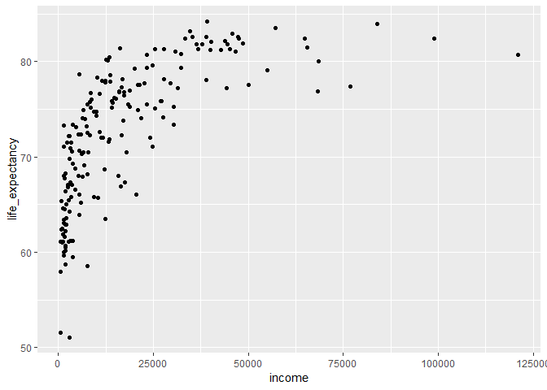
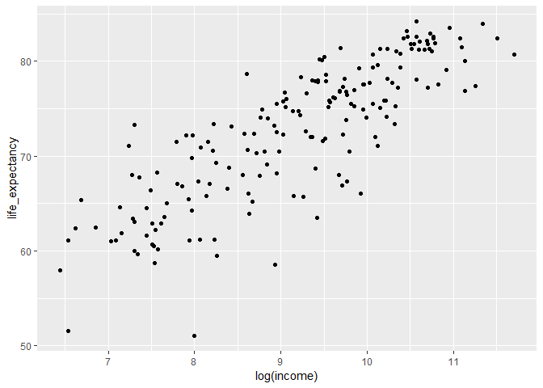
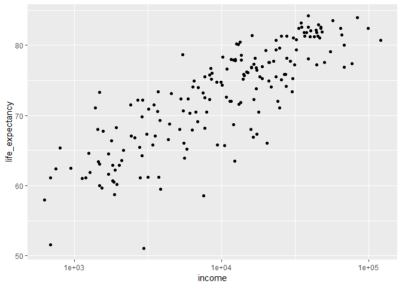
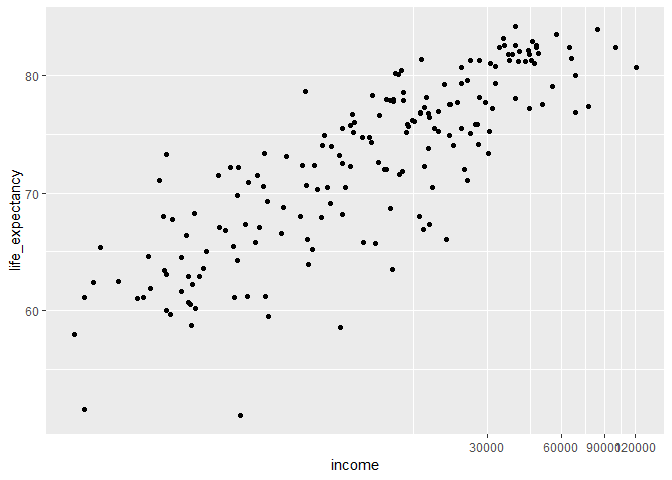
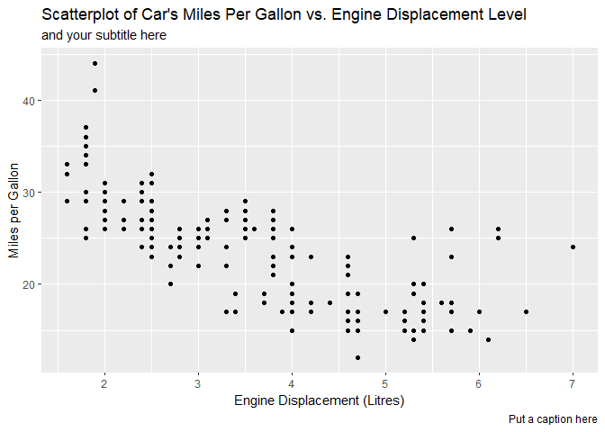
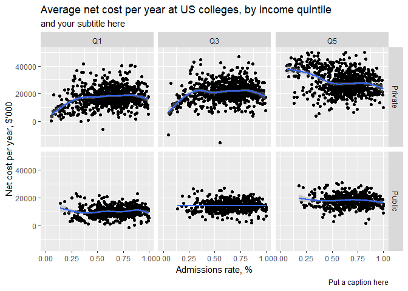

Further practice with `ggplot2`
================
Math 285, Adam Loy
Day 03

*To avoid merge conflicts, I recommend moving the activity files to a separate subdirectory within you math285 folder.*

Today, we'll use an excerpt of the data available at gapminder.org to explore how the essential elements of the grammar of graphics can be used to build various graphics.

Transforming your axes
----------------------

First, let's return to the `gapminder` data set and consider the scatterplot of life expectancy vs. adjusted per capita GDP for 193 countries in 2018.

``` r
gapminder <- readr::read_csv("https://aloy.rbind.io/data/gapminder2018.csv")
## Parsed with column specification:
## cols(
##   country = col_character(),
##   year = col_double(),
##   income = col_double(),
##   life_expectancy = col_double(),
##   population = col_double(),
##   four_regions = col_character(),
##   eight_regions = col_character(),
##   six_regions = col_character()
## )

ggplot(data = gapminder, mapping = aes(x = income, y = life_expectancy)) +
  geom_point()
## Warning: Removed 9 rows containing missing values (geom_point).
```



There is clearly a non-linear relationship between the variables, but is it linear on a logarithmic scale? In this exercise, you'll explore three ways to transform the axes.

**1.** Recreate the above scatterplot, but apply a `log10()` transformation to `income`.

``` r
# insert your code here
ggplot(data = gapminder, mapping = aes(x = log(income), y = life_expectancy)) +
  geom_point()
## Warning: Removed 9 rows containing missing values (geom_point).
```



**2.** Recreate the above scatterplot, adding the scale function `scale_x_log10()` after the `geom_point()` layer.

``` r
# insert your code here
ggplot(data = gapminder, mapping = aes(x = income, y = life_expectancy)) +
  geom_point() + scale_x_log10()
## Warning: Removed 9 rows containing missing values (geom_point).
```



**3.** Recreate the above scatterplot, adding the coordinate function `coord_trans(x = "log10")` after the `geom_point()` layer.

``` r
# insert your code here
ggplot(data = gapminder, mapping = aes(x = income, y = life_expectancy)) +
  geom_point() + coord_trans(x="log10")
## Warning: Removed 9 rows containing missing values (geom_point).
```



**4.** Which plot do you prefer? Why?

#### A bit more on `coord_trans()`

The `coord_trans()` function transforms the Cartesian coordinate system **after** statistical transformations. It enables you to independently transform the x- and y-axes through the `x` and `y` arguments, respectively.

Labeling your graphics
----------------------

While we have not formally discussed how to polish the axis labels and titles of your graphs, it is important to do so! Appropriate and clear titles and axis labels provide the reader with necessary context for your graphics, so that they understand the story that you are telling.

In `ggplot2` you can add/change the title, subtitle, caption, and x- and y-axis labels by adding a `labs()` layer. Below is an example illustrating it's use:

``` r
library(tidyverse)

ggplot(data = mpg) +
  geom_point(mapping = aes(x = displ, y = hwy)) +
  labs(
    title = "Scatterplot of Car's Miles Per Gallon vs. Engine Displacement Level",
    subtitle = "and your subtitle here",
    x = "Engine Displacement (Litres)",
    y = "Miles per Gallon",
    caption = "Put a caption here"
  )
```



Remember that you can always get help by running `?labs` in the console.

Reproducing a graph
-------------------

The *Economist* is a well-regarded weekly news magazine. The following graphic accompanied their article about the release of the "College Scorecard" data in Sept. 2015.


Your task is to reproduce this graph from the College Scorecard data, and perhaps enhance it.

We haven't covered all of the finer details of customizing `ggplot2` graphics yet, so if there is something you don't know how to change, write it down and you can return to this graphic next week to complete the process. Also, don't hesitate to read help files—e.g., `?geom_smooth` may prove helpful!

#### Loading the data

``` r
library(tidyverse)
scorecard <- read_csv("https://github.com/cmsc205/data/raw/master/ScorecardSmallNarrow.csv")
```

#### Data dictionary

-   `ADM_RATE`: admissions rate in percent
-   `CONTROL`: is the institution public or private?
-   `net_cost`: average net cost for students
-   `income_group`: the groups are defined as: $0 to $30K per year (Q1), $30-48K (Q2), $48-75K (Q3), $75-110K (Q4), $110K or more (Q5)

#### Reproduction

Try to reproduce the graphic below. Be sure to insert a code chunk before you start coding!

``` r
ggplot(data = scorecard) +
  geom_point(mapping = aes(x = ADM_RATE, y = net_cost)) + facet_grid(CONTROL~income_group)+ geom_smooth(mapping = aes(x = ADM_RATE, y = net_cost)) +
  labs(
    title = "Average net cost per year at US colleges, by income quintile",
    subtitle = "and your subtitle here",
    x = "Admissions rate, %",
    y = "Net cost per year, $'000",
    caption = "Put a caption here"
  )
## `geom_smooth()` using method = 'gam' and formula 'y ~ s(x, bs = "cs")'
## Warning: Removed 4729 rows containing non-finite values (stat_smooth).
## Warning: Removed 4729 rows containing missing values (geom_point).
```


